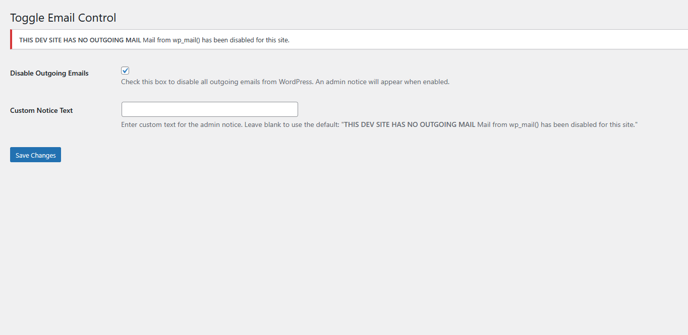
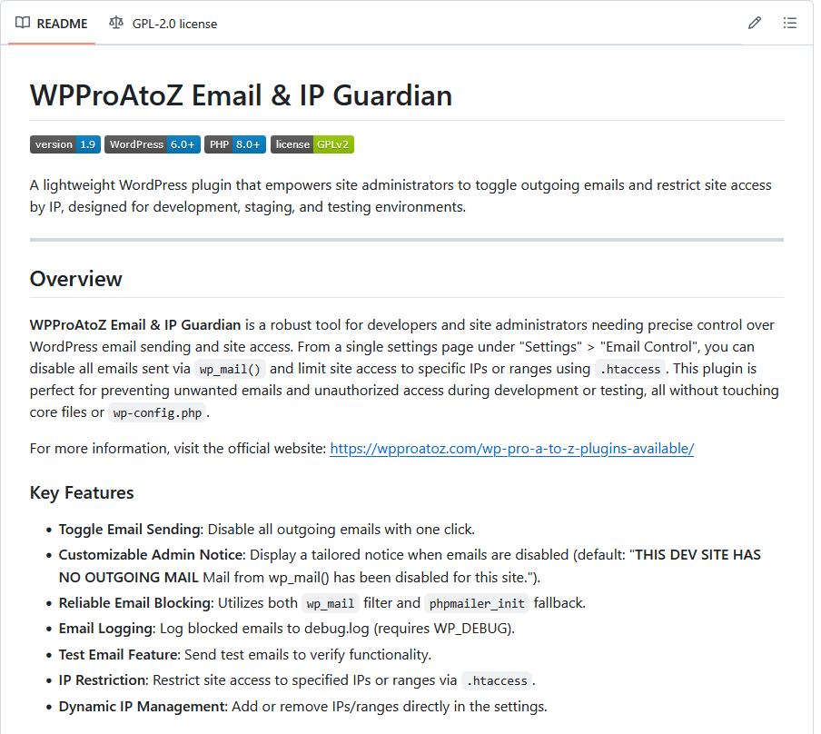

# WPProAtoZ Email & IP Guardian

A lightweight WordPress plugin that empowers site administrators to toggle outgoing emails and restrict site access by IP, designed for development, staging, and testing environments.

---

## Overview

**WPProAtoZ Email & IP Guardian** is a robust tool for developers and site administrators needing precise control over WordPress email sending and site access. From a single settings page under "Settings" > "IP & Email Controls", you can disable all emails sent via wp_mail() and limit site access to specific IPs or ranges using .htaccess. This plugin is perfect for preventing unwanted emails and unauthorized access during development or testing, all without touching core files or wp-config.php.

For more information, visit the official website: [https://wpproatoz.com/wp-pro-a-to-z-plugins-available/](https://wpproatoz.com/wp-pro-a-to-z-plugins-available/)

### Key Features
- **Toggle Email Sending**: Disable all outgoing emails with one click.
- **Customizable Admin Notice**: Display a tailored notice when emails are disabled (default: "<strong>THIS DEV SITE HAS NO OUTGOING MAIL</strong> Mail from wp_mail() has been disabled for this site.").
- **Reliable Email Blocking**: Utilizes both wp_mail filter and phpmailer_init fallback.
- **Email Logging**: Log blocked emails to debug.log (requires WP_DEBUG).
- **Test Email Feature**: Send test emails to verify functionality.
- **IP Restriction**: Restrict site access to specified IPs, ranges, or CIDRs via .htaccess.
- **Dynamic IP Management**: Add or remove IPs/ranges/CIDRs directly in the settings, with optional notes.
- **Documentation Tab**: Easy-to-update docs loaded from documentation.html.

## Installation
Download the plugin ZIP file from the [releases page](https://github.com/Ahkonsu/wpproatoz-turn-off-wpmail/releases).  
Upload it to your WordPress site via **Plugins** > **Add New** > **Upload Plugin**.  
Activate the plugin through the **Plugins** menu in WordPress.

## Usage
Navigate to **Settings > IP & Email Controls** in your WordPress admin dashboard.

### Email Settings
- Check "Disable Outgoing Emails" to stop all emails; a notice will appear.
- Customize the "Custom Notice Text" and "Notice Background Color" (optional).
- Enable "Log Blocked Emails" to track blocked emails in debug.log (requires WP_DEBUG).
- Click "Send Test Email" to test email functionality.

### IP Restriction Settings
- Check "Enable IP Restriction" to limit access to listed IPs (your current IP is auto-added).
- Add or remove IPs/ranges/CIDRs (e.g., 192.168.1.1-192.168.1.10 or 192.168.1.0/24) in "Allowed IPs", with optional notes.
- Save to update .htaccess.
- Uncheck options and save to revert changes.

### Admin Settings
Access the settings at **Settings > IP & Email Controls**. Switch to the Documentation tab for guides.

## Screenshots
**Admin Settings Page** - Configure email and IP settings seamlessly.  

**Admin Notice** - Customizable notice when emails are disabled.  

**IP List with Notes** - Manage IPs, ranges, CIDRs, and notes.  

## Frequently Asked Questions
**Why would I want to disable outgoing emails?**  
To prevent test emails from reaching real users in development or staging environments (e.g., password resets, order confirmations).

**Can I customize the admin notice?**  
Yes! Set custom text and a background color in the settings. Leave blank for the default: "<strong>THIS DEV SITE HAS NO OUTGOING MAIL</strong> Mail from wp_mail() has been disabled for this site."

**Does this block all emails?**  
Yes, it blocks all wp_mail() emails using a filter and phpmailer_init fallback for reliability across core, themes, and plugins.

**What happens when emails are disabled?**  
Emails are silently blocked, and wp_mail() returns as if successful to avoid plugin errors.

**Can I see which emails were blocked?**  
Enable "Log Blocked Emails" to record details in debug.log (requires WP_DEBUG).

**How does IP restriction work?**  
It modifies .htaccess to allow only specified IPs/ranges/CIDRs, blocking all other access on Apache servers.

**Does it support IP ranges or CIDR?**  
Yes, add ranges like 192.168.1.1-192.168.1.10 or CIDRs like 192.168.1.0/24 in the "Allowed IPs" section.

**What are IP notes for?**  
Optional labels (e.g., "Office VPN") to track what each IP is for—doesn't affect restrictions.

**How do I update documentation?**  
Edit documentation.html in the plugin directory; changes load on page refresh.

## Changelog
### 1.9.1
- Fixed initial .htaccess write for IP restrictions on first enable.
- Added CIDR notation support (e.g., 192.168.1.0/24) for efficient IP ranges.
- Added optional notes field for each allowed IP entry, with balanced UI layout.
- Added Documentation tab to settings page, loading from documentation.html for easy updates.

### 1.9
Renamed plugin to "WPProAtoZ Email & IP Guardian" for improved branding.  
Added "Settings" link to plugin listing for quick access.  
Updated text domain and .htaccess marker to reflect new name.

### 1.8-beta
Added IP restriction feature with dynamic IP/range management via .htaccess.  
Enhanced email blocking with dual-layer approach (wp_mail filter and phpmailer_init).

### 1.7
Adjusted plugin name consistency and minor tweaks.

### 1.6
Added screenshot to documentation.

### 1.5
Introduced customizable admin notice text with a default fallback.

### 1.4
Added phpmailer_init fallback for reliable email blocking.  
Fixed issue where emails were sent in some edge cases.

### 1.3
Modified wp_mail filter to return false when emails are disabled.

### 1.2
Resolved infinite recursion by switching to wp_mail filter from pluggable function.

### 1.1
Added admin notice that toggles with email disable setting.

### 1.0
Initial release with basic email toggle functionality.

## Upgrade Notice
### 1.9.1
Update for enhanced IP features (CIDR, notes), fixed initial setup, and new Documentation tab.

### 1.9
Update for a new name, improved branding, and a convenient "Settings" link in the plugin listing.

### 1.8-beta
Major update adding IP restriction features—test thoroughly in a staging environment.

### 1.5
Adds customizable notice text—update to personalize your admin experience!

## License
This plugin is licensed under the [GPLv2 or later](https://www.gnu.org/licenses/gpl-2.0.html). You are free to use, modify, and distribute it as per the license terms.

## Contributing
Contributions are welcome! Feel free to fork the repository, submit issues, or create pull requests on [GitHub](https://github.com/Ahkonsu/wpproatoz-turn-off-wpmail).

## Credits
Developed with assistance from xAI’s Grok for debugging and optimization.